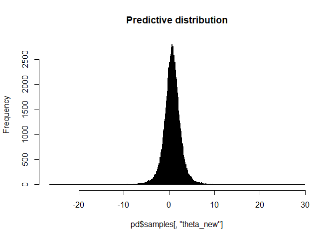

<!-- README.md is generated from README.Rmd. Please edit that file -->
<!-- README.Rmd needs to be rendered to MD with devtools::build_readme() -->

# metaprediction

<!-- badges: start -->
<!-- badges: end -->

The metaprediction package provides methods to construct the frequentist
predictive distribution in meta-analysis using confidence distributions.

## Installation

You can install the development version of metaprediction from
[GitHub](https://github.com/) with:

``` r
# install.packages("pak")
pak::pak("davidkronthaler-dk/metaprediction")
```

## Example

This is a basic example of how to use the metaprediction package.

``` r
library(metaprediction)
# Estimates and standard errors from 5 studies
es <- c(1.17,  2.20,  1.10, -0.0019, -1.33) 
se <- c(0.52, 0.93, 0.63, 0.3, 0.28)
# Computation
pd <- PredDist(es = es, se = se, method = "FullCD")
# 95% prediction interval
pd$PI
#>      2.5%     97.5% 
#> -3.307166  4.472290
# Predictive distribution
hist(pd$samples[,"theta_new"], breaks = 500, main = "Predictive distribution")
```



``` r
# Probability of a future effect larger than 0
mean(pd$samples[,"theta_new"] > 0)
#> [1] 0.66279
```
